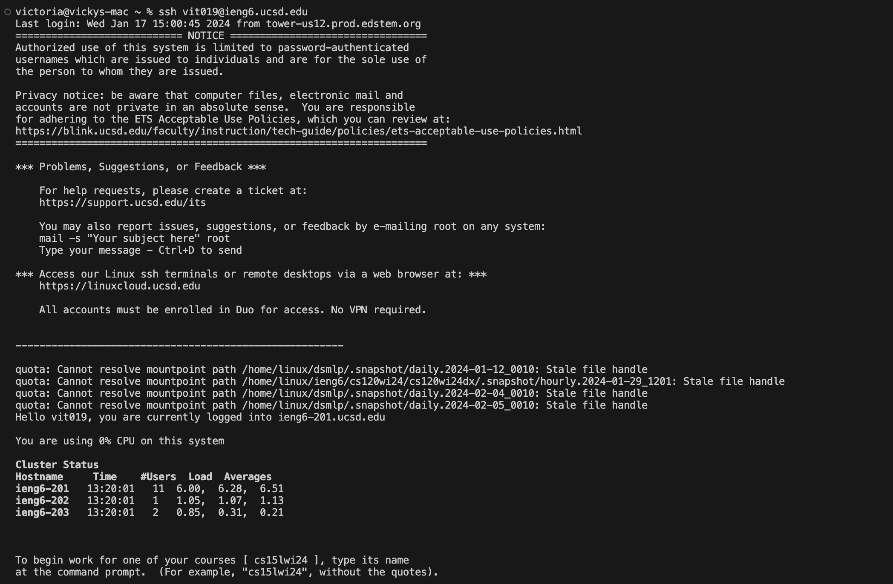
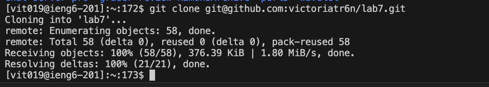
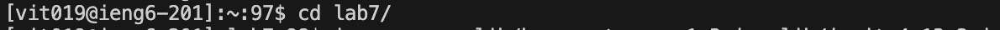
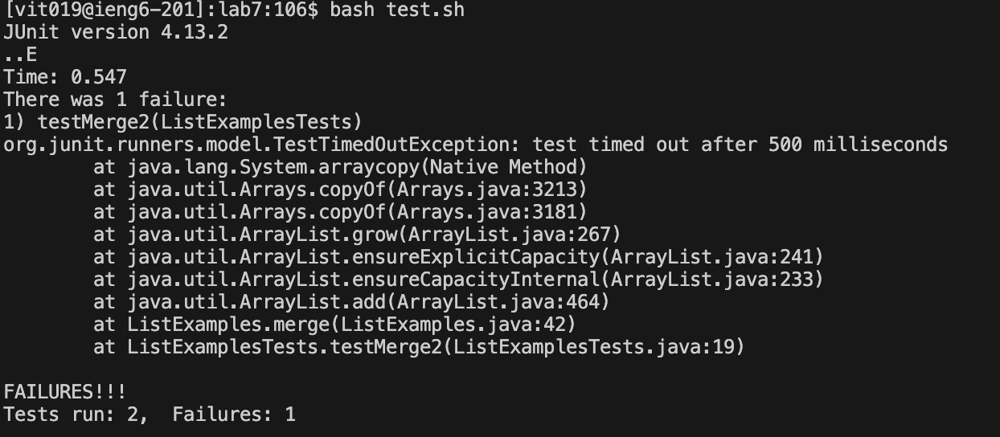
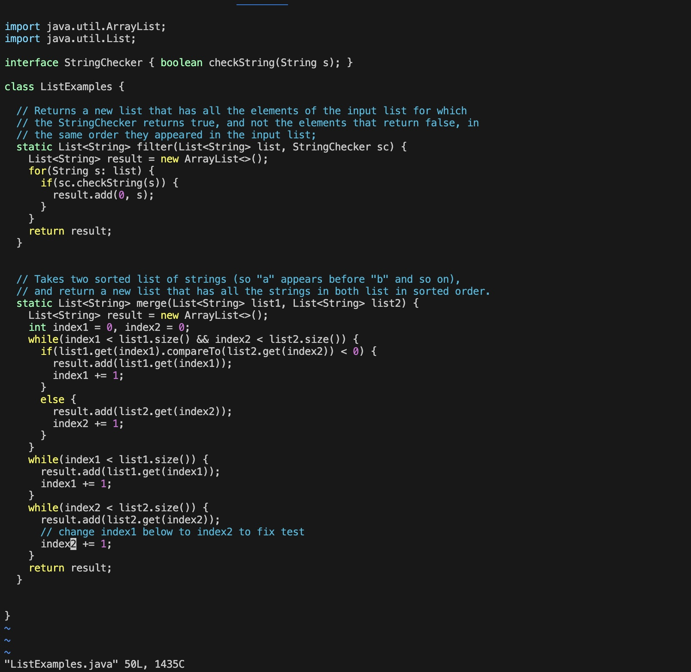
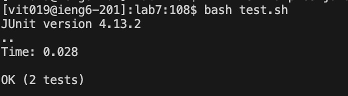
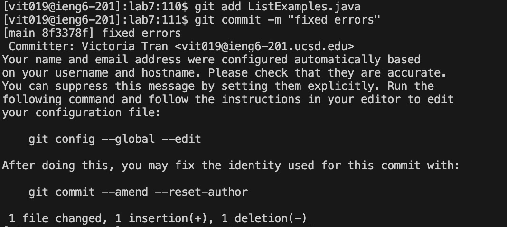
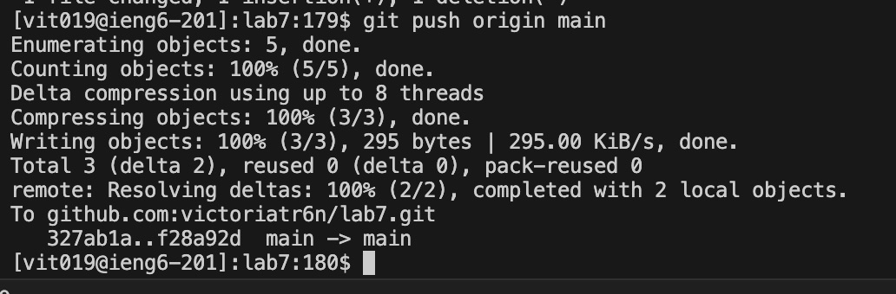

# Lab 7 Report

## Step 4: Log into ieng6

Keys pressed:`<up><up><enter>`
The `ssh vit019@ieng6.ucsd.edu` command was 2 up in my terminal history, so I used the up arrow two times to access it.
This command logs into my ieng6 account.

## Step 5: Clone your fork of the repository from your Github account

Keys pressed: `<g><i><t><space><c><l><o><n><e><space><Command><V><enter>`
I first copied my `SSH` url using `Command-C` from my forked github repository. Then typed `git clone` and used `Command-V` to paste the `SSH` url. Then pressed `<enter>` 
These commands clone the github repository into the ieng6 account.

## Step 6: Run the tests

Keys pressed: `<c><d><l><tab><enter><b><a><s><h><space><t><e><s><t><.><s><h><enter>`
I changed my directory to the lab7 directory and typed `bash test.sh` and `<enter` to run the bash script, which compiled and ran the test file `ListExamples.java`.

## Step 7: Edit the code file to fix the failing test

Keys pressed: `<v><i><m><space><L><tab><.><tab><enter></><c><h><a><n><g><e><enter><J><L><L><X><I><2><esc><:><x><enter>`
I typed `vim ListExamples.java` to open vim on the file and then used `/change` to search for the line I needed to change to fix the bug. Then, I used `<J>` to go down one line and `<L>`
to move two spaces to the right so the cursor was over the `1` in `index1` to edit the `index1` to `index2`. I used `<X>` to delete the `1` and then `<I><2>` to insert a 2 after `index`. To save my changes, I used `<esc><:><x><enter>` to 
return to the normal mode and save and exit `vim`.

## Step 8: Run the tests, demonstrating that they now succeed

Keys pressed: `<up><up><enter>`
The `bash test.sh` command was 2 up in my terminal history, so I used the up arrow two times to access it. The command runs the bash script, which compiles and runs the test file `ListExamples.java`.

## Step 9: Commit and push the resulting change to your Github account

Keys pressed: `<g><i><t><space><a><d><d><space<L><tab><.><tab><enter><g><i><t><space><c><o><m><m><i><t><space><-><m><space><"><f><i><x><e><d><space><e><r><r><o><r><s><"><enter><g><i><t><space>
<u><s><h><space><o><r><i><g><i><n><space><m><a><i><n><enter>`
The `git add ListExamples.java` command selects the file given and prepares it to get committed. 
The `git commit -m "fixed error"` commits the changes in the file `ListExample.java` to the main branch with the comment `"fixed error"`
The `git push origin main` command pushes the changes I made locally in the `ListExamples.java` file to the remote repository in GitHub. It will go to the main branch.
