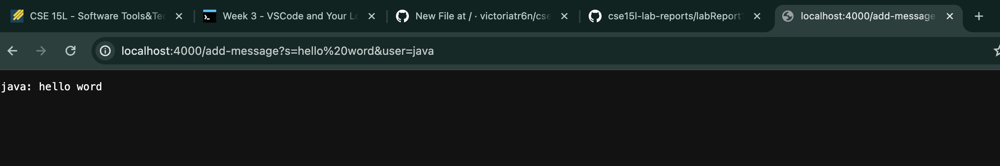
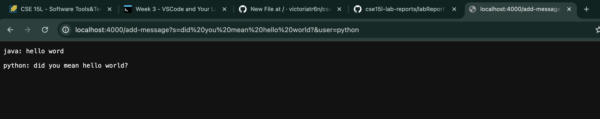

# Part 1 
# `ChatServer` Implementation 
(in ChatServer.java file)
```
import java.io.IOException;
import java.net.URI;

class Handler implements URLHandler {
    // The one bit of state on the server: a number that will be manipulated by
    // various requests.
    String output;
    public String handleRequest(URI url) { 
        if(url.getPath().equals("/")){
            return "Nothing inputed";
        }
        if (url.getPath().equals("/add-message")) {
            String[] afterAnd = url.getQuery().split("&");
            String[] messageArray = afterAnd[0].split("s=");
            String onlyMessage = messageArray[1];
            String[] userArray = afterAnd[1].split("user=");
            String onlyUser = userArray[userArray.length-1];
            String newString = String.format("%s: %s \n", onlyUser, onlyMessage);

            output = output+ newString + "\n";
            return output;
                
        }
        return "404 Not Found!";
    }
}

class ChatServer {
    public static void main(String[] args) throws IOException {
        if(args.length == 0){
            System.out.println("Missing port number! Try any number between 1024 to 49151");
            return;
        }

        int port = Integer.parseInt(args[0]);

        Server.start(port, new Handler());
    }
}
```
# `Server` Code 
(in `Server.java` file from previous labs)
```
import java.io.IOException;
import java.net.InetSocketAddress;
import java.io.OutputStream;
import java.net.URI;

import com.sun.net.httpserver.HttpExchange;
import com.sun.net.httpserver.HttpHandler;
import com.sun.net.httpserver.HttpServer;

interface URLHandler {
    String handleRequest(URI url);
}

class ServerHttpHandler implements HttpHandler {
    URLHandler handler;
    ServerHttpHandler(URLHandler handler) {
      this.handler = handler;
    }
    public void handle(final HttpExchange exchange) throws IOException {
        // form return body after being handled by program
        try {
            String ret = handler.handleRequest(exchange.getRequestURI());
            // form the return string and write it on the browser
            exchange.sendResponseHeaders(200, ret.getBytes().length);
            OutputStream os = exchange.getResponseBody();
            os.write(ret.getBytes());
            os.close();
        } catch(Exception e) {
            String response = e.toString();
            exchange.sendResponseHeaders(500, response.getBytes().length);
            OutputStream os = exchange.getResponseBody();
            os.write(response.getBytes());
            os.close();
        }
    }
}

public class Server {
    public static void start(int port, URLHandler handler) throws IOException {
        HttpServer server = HttpServer.create(new InetSocketAddress(port), 0);

        //create request entrypoint
        server.createContext("/", new ServerHttpHandler(handler));

        //start the server
        server.start();
        System.out.println("Server Started!");
    }
}
```
# Using `/add-message`
1. One message and one user
   
   When this path is used, the method `handleRequest` in the `ChatServer` file is run.
   The relevant argument of the method is `URI url`, which gets the URL from the server with the path and query appended to it. The value of the String field `output` is "", so it is blank when the `handleRequest` method is first run.
   The String `newString` is initiated with the formatted String of the user and the message, so it stores `"java: hello word"`. The value of `output` gets updated to the `newString` and a new line due to this request.
3. Two messages and two users
   
   When this path is used, the method `handleRequest` in the `ChatServer` file is run.
   The relevant argument of the method is `URI url`, which gets the URL from the server with the path and query appended to it. The value of the String field `output` is `"java: hello word"`, from the previous request. The String `newString` gets initiated to store `"python: did you mean hello world?"`.
   The value of `output` gets updated to:
       `"java: hello word \n
       python: did you mean hello world?"`
   

# Part 2
# Part 3

Something I learned from lab in week 3 is that you can run the command `man + [command]` to find the manual for the command that you want to find out more information about.  
