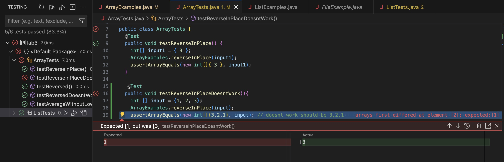

# Lab Report 3 Part 1
# Bug - reverseInPlace() method
```
static void reverseInPlace(int[] arr) {
    for(int i = 0; i < arr.length; i += 1) {
      arr[i] = arr[arr.length - i - 1];
    }
}
```
## Failure inducing input:
```
@Test
public void testReverseInPlaceDoesntWork(){
    int [] input = {1, 2, 3};
    ArrayExamples.reverseInPlace(input);
    assertArrayEquals(new int[]{3,2,1}, input); 
}
```
## Input that doesn't induce a failure:
```
@Test 
public void testReverseInPlace() {
    int[] input1 = { 3 };
    ArrayExamples.reverseInPlace(input1);
    assertArrayEquals(new int[]{ 3 }, input1);
}
```
## Symptom:


## Bug and Fix:
Original code with bug:
```
static void reverseInPlace(int[] arr) {
    for(int i = 0; i < arr.length; i += 1) {
      arr[i] = arr[arr.length - i - 1];
    }
}
```

Fixed code:
```
static void reverseInPlace(int[] arr) {
    int firstElement = arr[0];
    for(int i = 0; i < arr.length-1; i += 1) {
      arr[i] = arr[arr.length - i - 1]; 
    }
    arr[arr.length-1] = firstElement;
}
```
The bug in the code is that the `reversedInPlace` method loses the first element of the original array, so once the for loop gets to the last element, it will set it to the first element of the updated array, which is the last element of the original array. To fix this bug, make a variable `int firstElement = arr[0];` before the for loop. Then, iterate up until the second to last element, so the condition in the for loop should be `i< arr.length -1;` after the for loop completely iterates, set `arr[arr.length-1] = firstElement;` This will make sure that the original first element gets saved and then added back to the reversed array.

# Part 2
`find` 
command-line options (Source: https://www.redhat.com/sysadmin/linux-find-command):
`-name`
`-iname`
`-type d`
`-maxdepth`

## `-name` examples
command (in the technical directory)
```
find . -name "chapter-6.txt"
```
output
```
./911report/chapter-6.txt
```

command (in the technical directory)
```
find . -name "bill.txt"
```
output
```
./government/Env_Prot_Agen/bill.txt
```
The -name option searches the current directory for files that match the name given in the command line. It is helpful for when you remember the name of a file but are not sure of where exactly the file is.

## `-iname` examples
command (in the technical directory)
```
find . -iname "*chapter-13*.txt"
```
output
```
./911report/chapter-13.4.txt
./911report/chapter-13.5.txt
./911report/chapter-13.1.txt
./911report/chapter-13.2.txt
./911report/chapter-13.3.txt
```

command (in the technical directory)
```
find . -iname "*ctf*.txt"
```
output
```
./government/Env_Prot_Agen/ctf7-10.txt
./government/Env_Prot_Agen/ctf1-6.txt
```
The -iname option searches the current directory for files that closely match the name given in the command line. It is helpful for when you don't exactly remember the name of the files and where exactly the file is.

## `-type d` examples
command (in the technical/government directory)
```
find . -type d
```
output
```
.
./government
./government/About_LSC
./government/Env_Prot_Agen
./government/Alcohol_Problems
./government/Gen_Account_Office
./government/Post_Rate_Comm
./government/Media
./plos
./biomed
./911report
```

command (in the technical directory)
```
find government/ -type d
```
output
```
government/
government//About_LSC
government//Env_Prot_Agen
government//Alcohol_Problems
government//Gen_Account_Office
government//Post_Rate_Comm
government//Media
```
The -type d option searches the directory given and returns all the directory paths. It is helpful when you want to search inside a directory but do not want every single file or directory in it, only the directory paths.

## `-type f` examples
command (in the technical directory)
```
find /government/Alcohol_Problems/ -type f
```
output
```
.
./government
./government/About_LSC
./government/Env_Prot_Agen
./government/Alcohol_Problems
./government/Gen_Account_Office
./government/Post_Rate_Comm
./government/Media
./plos
./biomed
./911report
```

command (in the technical directory)
```
find . -iname "*legal*.txt" -type f 
```
output
```
./government/About_LSC/LegalServCorp_v_VelazquezSyllabus.txt
./government/About_LSC/LegalServCorp_v_VelazquezDissent.txt
./government/About_LSC/ONTARIO_LEGAL_AID_SERIES.txt
./government/About_LSC/LegalServCorp_v_VelazquezOpinion.txt
./government/Media/Legal-aid_chief.txt
./government/Media/Free_legal_service.txt
./government/Media/Legal_system_fails_poor.txt
./government/Media/Supporting_Legal_Center.txt
./government/Media/Providing_Legal_Aid.txt
./government/Media/Legal_Aid_in_Clay_County.txt
./government/Media/Legal_hotline.txt
./government/Media/Poor_Lacking_Legal_Aid.txt
./government/Media/Paralegal_Honored.txt
./government/Media/Coup_Reshapes_Legal_Aid.txt
./government/Media/Legal_Aid_looks_to_legislators.txt
./government/Media/Boone_legal_service.txt
./government/Media/Free_Legal_Assistance.txt
./government/Media/Marylands_Legal_Aid.txt
./government/Media/Legal_Aid_Society.txt
./government/Media/Valley_Needing_Legal_Services.txt
./government/Media/Legal_Aid_attorney.txt
```
The -type f option searches the given directory for files only. This is helpful when you want to search in a directory but only want the files contained in it and not the directories. 
